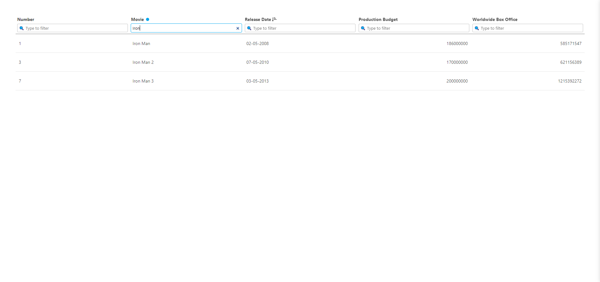

### 🎁 Installing dependencies

This project uses `yarn`.
You can run the following command to install all dependencies.

```sh
yarn install
```

### 🛠️ Running the dev server

To see what you're building run the following command:

```sh
yarn start
```

It will start the dev-server and open a page in your default browser.

### 🧪 Testing

This project uses [`jest`](https://jestjs.io/) as a test runner.
The tests are written using [`@testing-library/react`](https://testing-library.com/docs/react-testing-library/intro).
Also, we have enhanced the `expects` with [`@testing-library/jest-dom`](https://github.com/testing-library/jest-dom) to give you some more explicit assertions.

You can run all tests with the following command:

```sh
yarn test
```

## 📝 Design decisions and feedback

_Here you can leave any comments about your design decisions, further instructions and comments as well as feedback._

Screenshot:



See it live: https://arijitpatra.in/filtering-and-sorting

Thoughts:

1. TypeScript should be adopted for type safety and more robust code as the next steps. In the interest of time this has not been configured for now, since this is an exisiting project, there can be issues with dependencies which can take little time to resolve. Would have loved to use Typescript here, I generally use TypeScript with ReactJS.

2. E2E tests can be done using tools like Cypress for more app reliability / regression.

3. In Table.js code the loop to render the rows was using index as key which is not a good practice, fixed it.

4. In the Release Date column there are values which consist of only the year (example: 2020) and "Unknown". If only year is there then it will be treated as 01-01-yyyy. Unknown will be treated as a max safe integer value (ASSUMPTION: the given year is >= 1970). If sorted in ascending order Unknown will be at the end.

5. In the Production Budget & Worldwide Box Office columns for some rows there are corresponding object and value, so it displays blank. If sorted in ascending order, blanks will be at the end.

6. The search/filtering is made debounced for better performance, maybe at current scale it is not a problem without debounce, but debounce would help if the client side dataset is huge or API call is needed, especially it is also very important if APIs are pay-as-you-use.

7. A 'clear all filters' button can be added for a better UX. In the interest of time this has not been coded for now.

8. Used an indicator beside the column names when the filter has a value, for now it is a blue dot, can be something else like filter icon.

9. Added title and accessibility description on the column headings about the sort for good UX and accessibility.

10. If the data was coming from API, Table component could be lazily loaded with a loader wrapped in React Suspense.

11. All utils/custom hooks/constants etc are properly segregated so that they can be reused easily and also its good for maintainability.

12. More tests could be added for further improvement.

13. For styling CSS modules is good here because it scopes the class names, I would have also used the same but maybe with SCSS because of the ease o fuse of the pre-processor, but CSS is also fine for the requirements here.

14. A message is shown if dataset matches none of the filters for good UX.

15. Filter uses 'includes' logic, 'startsWith' can be used instead of 'includes' if we want starts with kind of search.

16. Since Table code was directly under components folder, I didn't change it, I would have maybe put it in a sub-folder under components, like how I did for others.

17. Memoization techniques like useMemo/useCallback were considered, but for the current use case it is not required, as per React docs we should use them only when really necessary because React itself handles optimizations quite well.

18. Mobile UI has not been considered for the current scope of work.

